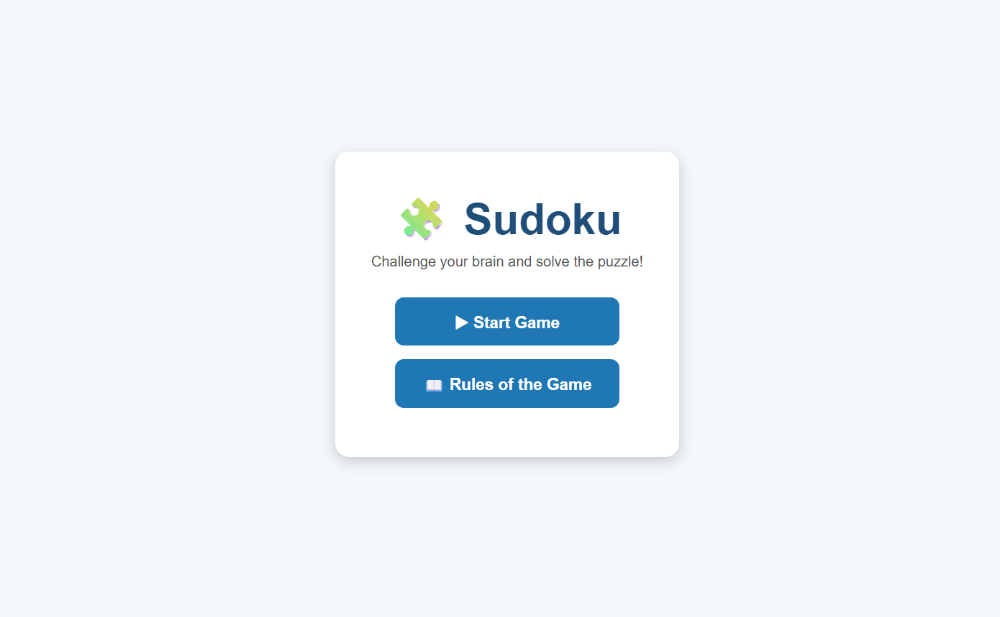
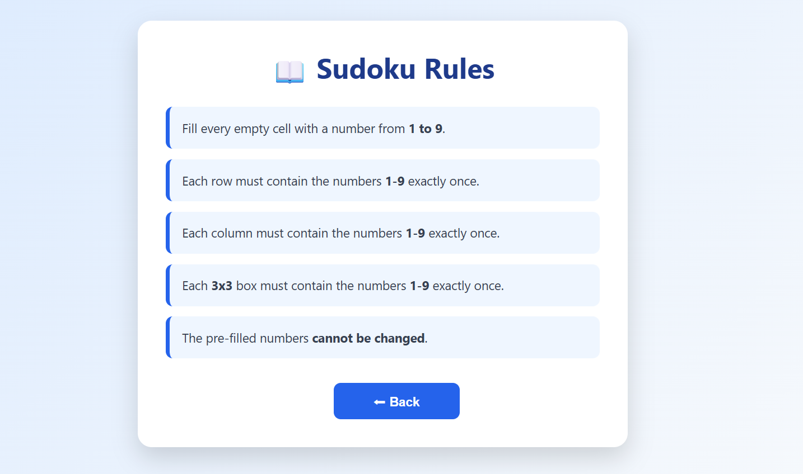
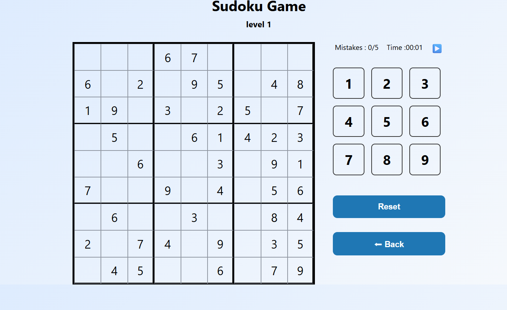
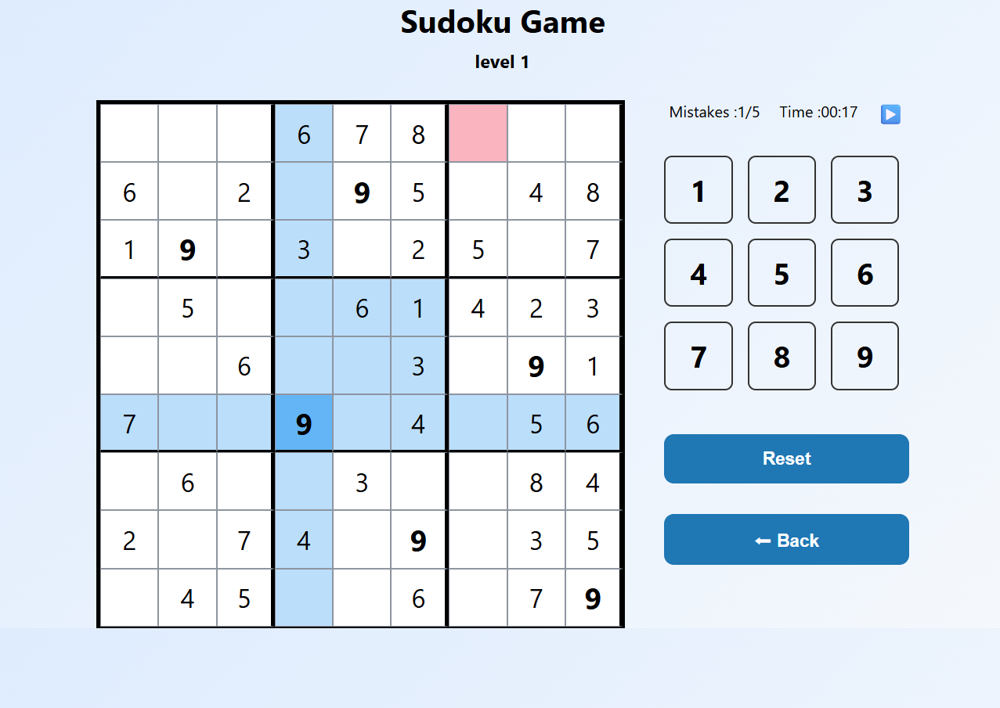

# Project Name :  Sudoku Game

## Technologies Used
- HTML5
- CSS3
- JavaScript 

## Description
Sudoku Game is a web-based puzzle game built using HTML, CSS, and JavaScript. The player must fill the empty cells with numbers from 1 to 9 while following the standard Sudoku rules. The game includes a timer, mistake counter, pause/resume functionality, light and dark mode, and a rules page to help new players understand how to play.
## User Stories
 1. As a user, I want to start a new Sudoku game from the home page.
2. As a user, I want to read the game rules before playing.
3. As a user, I want to select numbers and fill empty cells by clicking on them.
4. As a user, I want to receive feedback when I enter an incorrect number.
5. As a user, I want to see the elapsed game time.
6. As a user, I want to pause and resume the game at any time.
7. As a user, I want to track the number of mistakes I have made.
8. As a user, I want to use a back button to return to the home page.
9. As a user, I want to win when I correctly complete the Sudoku board.
## Screenshots

## Future Enhancements

- Add multiple difficulty levels (Easy, Medium, Hard).
- Generate Sudoku puzzles randomly.
- Save the player's progress .
- Add hints for difficult cells.
- Display player statistics (best time, games won, mistakes).
- Make the game fully responsive for mobile devices.
- Add keyboard support for entering numbers.
- Add animations when completing rows, columns, or the entire puzzle.